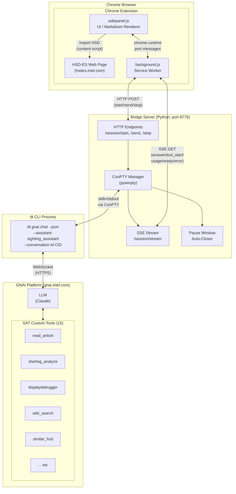
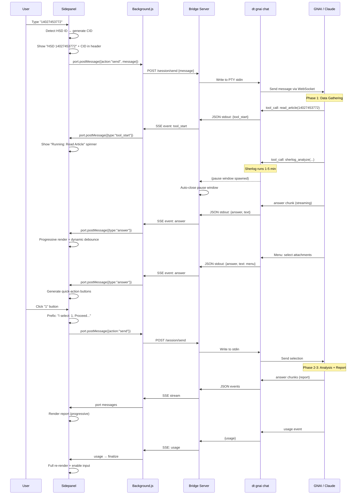

# Chat Mode Assistant — Architecture Overview

## System Flow Diagram



## Data Flow — User Sends HSD ID



## Component Responsibilities

```
┌─────────────────────────────────────────────────────────┐
│  Chrome Extension                                       │
│  ┌─────────────────────┐  ┌──────────────────────────┐  │
│  │  sidepanel.js        │  │  background.js           │  │
│  │                      │  │                          │  │
│  │  • UI rendering      │  │  • Bridge auto-launch    │  │
│  │  • Markdown parser   │  │  • SSE consumer          │  │
│  │  • Progressive render│  │  • HTTP relay             │  │
│  │  • Quick-action btns │  │  • Port ↔ bridge relay   │  │
│  │  • Import HSD        │  │  • Health check          │  │
│  │  • Save to HTML      │  │  • Native Messaging      │  │
│  │  • Session history   │  │  • Reconnect logic       │  │
│  │  • CID generation    │  │                          │  │
│  └─────────────────────┘  └──────────────────────────┘  │
└─────────────────────────────────────────────────────────┘
                         │ HTTP / SSE
┌─────────────────────────────────────────────────────────┐
│  Bridge Server (bridge_server.py)                       │
│                                                          │
│  • Manage dt process lifecycle (ConPTY)                  │
│  • Parse JSON events from dt stdout                      │
│  • Translate to SSE for Extension                        │
│  • Auto-close pause windows                              │
│  • Conversation ID passthrough                           │
│  • CORS + optional API key auth                          │
└─────────────────────────────────────────────────────────┘
                         │ ConPTY stdin/stdout
┌─────────────────────────────────────────────────────────┐
│  dt gnai chat --json --assistant sighting_assistant      │
│                                                          │
│  • GNAI CLI binary (Go)                                  │
│  • WebSocket connection to gnai.intel.com                │
│  • Streams JSON events: answer, tool_start, usage, etc.  │
│  • Loads registered toolkits (sherlog, displaydebugger)  │
└─────────────────────────────────────────────────────────┘
                         │ WebSocket (HTTPS)
┌─────────────────────────────────────────────────────────┐
│  GNAI Platform (gnai.intel.com)                         │
│                                                          │
│  • LLM orchestration (Claude)                            │
│  • 15 SAT custom tools                                   │
│  • Conversation history management                       │
│  • Token limit: 200K                                     │
└─────────────────────────────────────────────────────────┘
```

## Key Design Decisions

| Decision | Reason |
|----------|--------|
| ConPTY instead of pipe | `dt` (Go binary) block-buffers stdout on pipes; ConPTY forces line-buffered output for real-time streaming |
| Bridge as HTTP server | Chrome Extension cannot spawn processes; needs localhost HTTP relay |
| Progressive render | Large reports (30KB+) cause O(n²) DOM updates; frozen/tail node split reduces to O(n) |
| Dynamic debounce | 300ms→1200ms based on text size prevents CPU overload during streaming |
| CID = HSD_ID + timestamp | Each analysis session gets unique ID even for same HSD; enables future session switching |
| `--json` mode | Required for structured events (answer/tool_start/usage); but has known context bug on menu selection |
